# CloudSkew Architecture

CloudSkew is a free online diagram editor for sketching cloud architecture diagrams ([see a quick demo video](https://www.youtube.com/watch?v=d-lIrtaFUe0)). Icons for AWS, Azure, GCP, Kubernetes, Alibaba Cloud, Oracle Cloud etc are already preloaded in the app. All diagrams are securely saved in the cloud. Here are some [sample diagrams](./../docs/samples.md) created with CloudSkew. The full list of CloudSkew's features & capabilities can be seen [here](../docs/features.md). Currently, the product is in public preview.

In this document, we'll do a deep-dive on CloudSkew's building blocks while also discussing the lessons learnt, key decisions & trade offs made _(this living document will be frequently updated as the architecture evolves)_. The diagram below represents the overall architecture of CloudSkew.

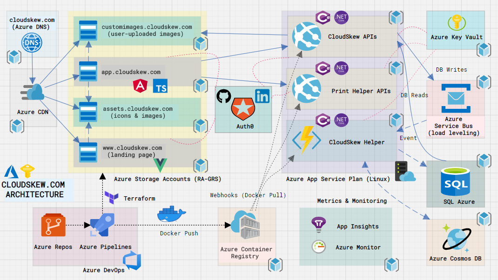

<i><small><b>CloudSkew Architecture</b></small></i>

CloudSkew's infrastructure has been built on top of various Azure services - snapped together like lego blocks. Let's now take a look at the individual pieces.

::: tip
This article is a part of the #AppliedCloudStoriesContest [(aka.ms/applied-cloud-stories)](https://www.cloudstories.dev) and #AzureDevStories [(http://konf.me/ds)](http://konf.me/ds) initiatives.
:::

## Apps

At it's core, CloudSkew's front-end consists of two web apps:

* [The landing page](/README.md) is a static VuePress site, with all pages authored in markdown. The default VuePress theme is used without any customization, although we're loading some marketplace plugins for image zoom, google analytics, sitemap generation etc. All images on this site are loaded from a CDN. The choice of VuePress for SSG was mainly down to its simplicity.

* [The diagram editor](https://app.cloudskew.com) is an Angular 8 SPA written in TypeScript _(more details on the internals of this app will be shared in future articles)_. To access the app, users are required to login using their GitHub or LinkedIn credentials. This app too loads all its static assets from a CDN, while relying on the [back-end web APIs](#web-apis) for fetching dynamic content. The choice of Angular as the front-end framework was mainly driven by our familiarity with it from prior projects.

## Web APIs

The back-end consists of two web API apps, both authored using ASP.NET Core 3.1:

* The **CloudSkew APIs** facilitates CRUD operations over diagrams, diagram templates and user profiles.

* The **DiagramHelper APIs** are required for printing or exporting (as PNG/JPG) diagrams. These APIs are isolated in a separate app since the memory footprint is higher causing the process to recycle more often.

Using ASP.NET Core's [middleware](https://docs.microsoft.com/en-us/aspnet/core/fundamentals/middleware/?view=aspnetcore-3.1), we ensure that:

* JWT authentication is enforced. Use of [policy-based authorization](https://docs.microsoft.com/en-us/aspnet/core/security/authorization/policies?view=aspnetcore-3.1) for RBAC ensures that claims mapping to user permissions are present in the JWT.
* Only the diagram editor (front-end app) can invoke these APIs ([CORS settings](https://docs.microsoft.com/en-us/aspnet/core/security/cors?view=aspnetcore-3.1)).
* Brotli [response compression](https://docs.microsoft.com/en-us/aspnet/core/performance/response-compression?view=aspnetcore-3.1) is enabled for reducing payload sizes.

The web APIs are stateless and operate under the assumption that they can be restarted/redeployed any time. No sticky sessions & affinities, no in-memory state, all state is persisted to DBs using [EF Core](https://docs.microsoft.com/en-us/ef/core/) (an ORM).

Separate DTO/REST and DBContext/SQL models are maintained for all entities, with [AutoMapper](https://automapper.org/) rules being used for conversions between the two.

## Identity, AuthN & AuthZ

[Auth0](https://auth0.com/) is used as the (OIDC compliant) identity platform for CloudSkew. Users can login via Github or LinkedIn; the handshake with these identity providers is managed by Auth0 itself. Using implicit flow, ID and access tokens (JWTs) are granted to the diagram editor app. The [Auth0.JS SDK](https://auth0.com/docs/libraries/auth0js/v9) makes all this really trivial to implement. All calls to the back-end web APIs use the access token as the bearer.

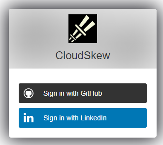

Auth0 creates & maintains the user profiles for all signed-up users. Authorization/RBAC is managed by assigning [Auth0 roles](https://auth0.com/docs/authorization/concepts/rbac) to these user profiles. Each role contains a collections of permissions that can be assigned to the users (they show up as custom claims in the JWTs).

Auth0 [rules](https://auth0.com/docs/rules) are used to inject custom claims in the JWT and whitelist/blacklist users.

## Databases

[SQL Azure](https://docs.microsoft.com/en-us/azure/sql-database/sql-database-technical-overview) is used for persisting user data; primarily three entities: `Diagram`, `DiagramTemplate` and `UserProfile`. User credentials are not stored in CloudSkew's database (that part is handled by Auth0). User contact details like emails are MD5 hashed.

Because of CloudSkew's auto-save feature, updates to the `Diagram` table happens very frequently. Some steps have been taken to optimize this:

* [Debouncing](https://rxjs-dev.firebaseapp.com/api/operators/debounceTime) the auto-save requests from the diagram editor UI to the Web API.
* Use of a queue for load-leveling the update requests (see [this section](#queue-based-load-leveling) for details).

For the preview version, the SQL Azure SKU being used in production is `Standard/S0 with 20 DTUs (single database)`. Currently, the DB is only available in one region. Auto-failover groups & active geo-replication (read-replicas) are not being used at present.

SQL Azure's [built-in geo-redundant DB backups](https://docs.microsoft.com/en-us/azure/sql-database/sql-database-automated-backups?tabs=single-database) offer weekly full DB backups, differential DB backups every 12 hours and transaction log backups every 5 - 10 minutes. SQL Azure internally stores the backups in RA-GRS storage for 7 days. RTO is 12 hrs and RTO is 1 hr. Perhaps less than ideal, but we'll look to improve matters here once CloudSkew's usage grows.

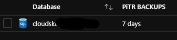

[Azure CosmosDB](https://docs.microsoft.com/en-us/azure/cosmos-db/introduction)'s usage is purely experimental at this point, mainly for the analysis of anonymized, read-only user data in [graph format over gremlin APIs](https://docs.microsoft.com/en-us/azure/cosmos-db/graph-introduction) _(more details on this will be shared in a future article)_. Technically speaking, this database can be removed without any impact to user-facing features.

## Hosting & Storage

Two [Azure Storage Accounts](https://docs.microsoft.com/en-us/azure/storage/blobs/storage-blobs-overview) are provisioned for hosting the front-end apps: landing page & diagram editor. The apps are served via the `$web` blob containers for static sites.

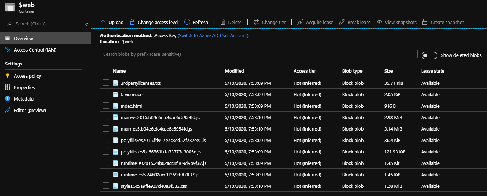

Two more storage accounts are provisioned for serving the static content (mostly icon SVGs) and user-uploaded images (PNG, JPG files) as blobs.

Two [Azure App Services on Linux](https://docs.microsoft.com/en-us/azure/app-service/containers/app-service-linux-intro) are also provisioned for hosting the containerized [back-end web APIs](#web-apis). Both app services share the same [App Service Plan](https://docs.microsoft.com/en-us/azure/app-service/overview-hosting-plans).

* For CloudSkew's preview version we're using the `B1 (100 ACU, 1.75 GB Mem)` plan which unfortunately does not include automatic horizontal scale-outs (i.e. scale-outs have to be done manually).
* Managed Identity is enabled for both app services, required for [accessing the Key Vault](#externalized-configuration-self-bootstrapping).
* The `Always On` settings have been enabled.
* An [Azure Container Registry](https://docs.microsoft.com/en-in/azure/container-registry/container-registry-intro) is also provisioned. The deployment pipeline packages the API apps as docker images and pushes to the container registry. The app services pull from it (using webhook notifications).

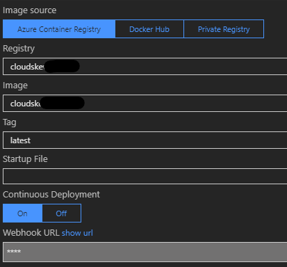

## Caching & Compression

An [Azure CDN profile](https://docs.microsoft.com/en-us/azure/cdn/cdn-overview) is provisioned with four endpoints, the first two using the hosted front-end apps (landing page & diagram editor) as origins and the other two pointing to the storage accounts (for icon SVGs & user-uploaded images).

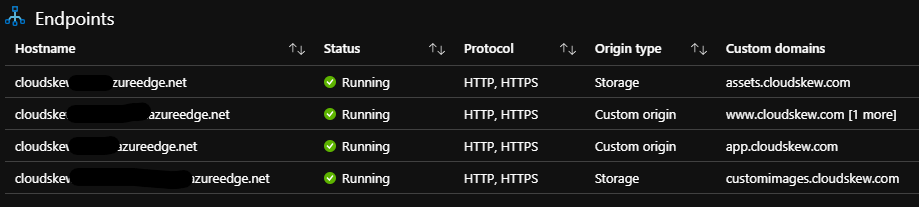

In addition to caching at global POPs, [content compression at POPs](https://docs.microsoft.com/en-us/azure/cdn/cdn-improve-performance) is also enabled.

## Subdomains & DNS records

All CDN endpoints have `<subdomain>.cloudskew.com` custom domain hostnames enabled on them. This is facilitated by using [Azure DNS](https://docs.microsoft.com/en-in/azure/dns/dns-overview) to create CNAME records that map `<subdomain>.cloudskew.com` to their CDN endpoint counterparts.

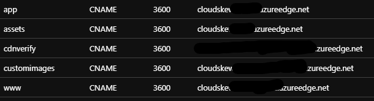

## HTTPS & TLS Certificates

Custom domain HTTPS is enabled and the TLS certificates are [managed by Azure CDN itself](https://docs.microsoft.com/en-us/azure/cdn/cdn-custom-ssl?tabs=option-1-default-enable-https-with-a-cdn-managed-certificate).

HTTP-to-HTTPS redirection is also enforced via [CDN rules](https://docs.microsoft.com/en-us/azure/cdn/cdn-standard-rules-engine).

## Externalized Configuration & Self-Bootstrapping

[Azure Key Vault](https://docs.microsoft.com/en-in/azure/key-vault/general/overview) is used as a secure, external, central key-value store. This helps decouple back-end web API apps from their configuration settings _(passwords, connection strings, endpoint urls, IP addresses, hostnames etc)_.

The web API apps have [managed identities](https://docs.microsoft.com/en-us/azure/key-vault/general/managed-identity) which are RBAC'ed for Key Vault access.

The web API apps self-bootstrap by reading their configuration settings from the Key Vault at startup. The handshake with the Key Vault is facilitated using the [Key Vault Configuration Provider](https://docs.microsoft.com/en-us/aspnet/core/security/key-vault-configuration?view=aspnetcore-3.1).

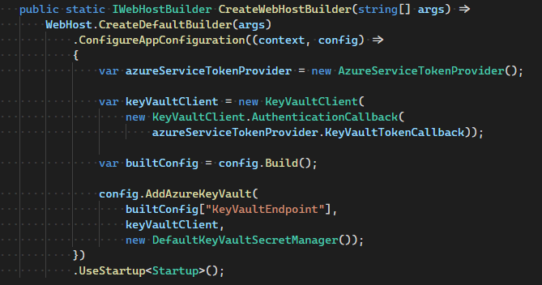

## Queue-Based Load Leveling

Even after debouncing calls to the API, the volume of PUT (UPDATE) requests generated by auto-save feature causes the SQL Azure DB's [DTU consumption](https://docs.microsoft.com/en-us/azure/sql-database/sql-database-service-tiers-dtu) to spike, resulting in service degradation. To smooth out this burst of requests, an [Azure Service bus](https://docs.microsoft.com/en-us/azure/service-bus-messaging/service-bus-messaging-overview) is used as an intermediate buffer. Instead of writing directly to the DB, the web API instead queues up all PUT requests into the service bus; to be drained asynchronously later.

An [Azure Function app](https://docs.microsoft.com/en-us/azure/azure-functions/functions-overview) is responsible for serially dequeueing the brokered messages off the bus using the [service bus trigger](https://docs.microsoft.com/en-us/azure/azure-functions/functions-bindings-service-bus-trigger?tabs=csharp). Once the function receives a [peek-locked](https://docs.microsoft.com/en-us/azure/service-bus-messaging/service-bus-performance-improvements?tabs=net-standard-sdk#receive-mode) messages, it commits the PUT (UPDATE) to the SQL Azure DB. If the function fails to process any messages, the messages automatically gets pushed onto the service bus' [dead-letter queue](https://docs.microsoft.com/en-us/azure/service-bus-messaging/service-bus-dead-letter-queues). An Azure monitor alert is triggered when this happens.

The Azure Function app shares the same app service plan as the back-end web APIs (i.e. uses the [dedicated app service plan](https://docs.microsoft.com/en-us/azure/azure-functions/functions-scale#app-service-plan) instead of the regular consumption plan)

Overall this [queue-based load-leveling pattern](https://docs.microsoft.com/en-us/azure/architecture/patterns/queue-based-load-leveling) has helped plateau the load on the Sql Azure DB.

## APM

The [Application Insights SDK](https://docs.microsoft.com/en-us/azure/azure-monitor/app/app-insights-overview) is used by the diagram editor (front-end [Angular SPA]((https://devblogs.microsoft.com/premier-developer/angular-how-to-add-application-insights-to-an-angular-spa/))) to get some user insights.

E.g. We're interested in tracking the names of icons that the users couldn't find in the icon palette (via the icon search box). This helps us add these frequently searched icons into the palette later on.

App Insight's [custom events](https://docs.microsoft.com/en-us/azure/azure-monitor/app/api-custom-events-metrics) help us log such information. [KQL queries](https://docs.microsoft.com/en-us/azure/data-explorer/kusto/query/samples) are used to mine the aggregated data.

The App Insight SDK is also used for [logging traces](https://docs.microsoft.com/en-us/azure/azure-monitor/app/api-custom-events-metrics#tracktrace). The log verbosity is configured via app config ([externalized config using Azure Key Vault](#externalized-configuration-self-bootstrapping)).

## Infrastructure Monitoring

[Azure Portal Dashboards](https://docs.microsoft.com/en-us/azure/azure-portal/azure-portal-dashboards) are used to visualize metrics from the various azure resources deployed by CloudSkew.

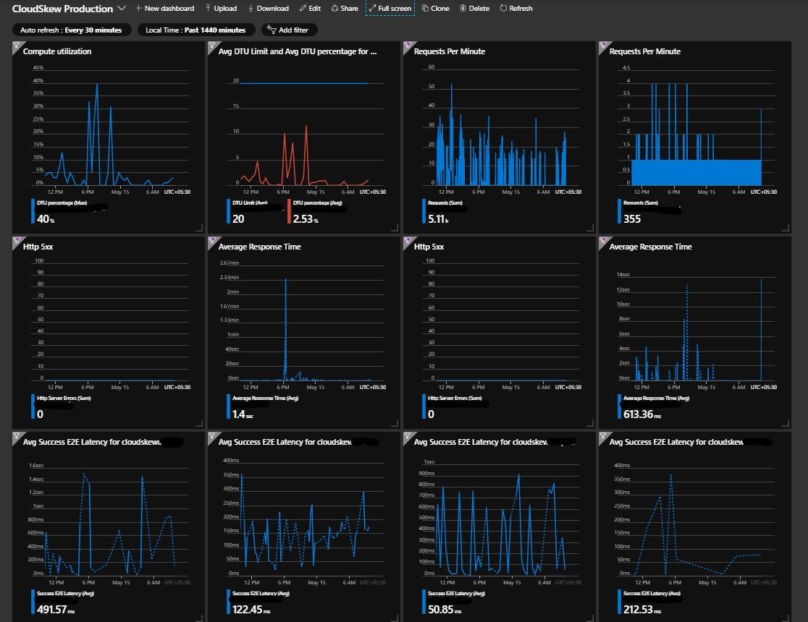

## Incident Management

[Azure Monitor's](https://docs.microsoft.com/en-us/azure/azure-monitor/overview) [metric-based alerts](https://docs.microsoft.com/en-us/azure/azure-monitor/platform/alerts-metric-overview) are being used to get incident notifications over email & slack. Some examples of conditions that trigger alerts:

* [Sev 0] 5xx errors in the web APIs required for printing/exporting diagrams.
* [Sev 1] 5xx errors in other CloudSkew web APIs
* [Sev 1] Any messages in the Service Bus' dead-letter queue.
* [Sev 2] Response time of web APIs crossing specified thresholds.
* [Sev 2] Spikes in DTU consumption in SQL Azure DBs.
* [Sev 3] Spikes in E2E latency for blob storage requests.

Metrics are evaluated/sampled at 15 mins frequency with 1 hr aggregation windows.

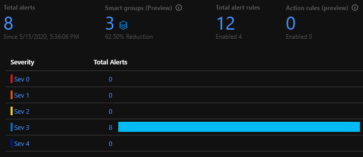

::: tip
Currently, 100% of the incoming metrics are sampled. Over time, as usage grows, we'll start filtering out outliers at P99.
:::

## Resource Provisioning

[Terraform](https://www.terraform.io/docs/index.html) scripts are used to provision all of the Azure resources & services shown in the architecture diagram (storage accounts, app services, CDN, DNS zone, container registry, functions, sql server, service bus etc). Use of terraform allows us to easily achieve parity in dev, test & prod environments. Although these three environments are mostly identical clones of each other, there are some minor differences:

* Across the dev, test and prod environments, the app configuration data stored in the Key Vaults will have the same key names but different values. This helps apps to bootstrap accordingly.
* The dev environments are ephemeral, created on demand and are disposed when not in use.
* For cost reasons, smaller resource SKUs are used in dev & test environments (e.g. Basic/B 5 DTUs SQL Azure in test environment as compared to Standard/S0 20 DTU in production).  

::: tip
The Auth0 tenant has been set up manually since there are no terraform providers for it. However it looks like it might be possible to automate the provisioning using [Auth0's Deploy CLI](https://auth0.com/docs/extensions/deploy-cli).
:::

## Continuous Integration

The source code is split across multiple private [Azure Repos](https://docs.microsoft.com/en-us/azure/devops/repos/get-started/what-is-repos?view=azure-devops). The _"one repository per app"_ rule of thumb is enforced here. An app is deployed to dev, test & prod environments from the same repo.

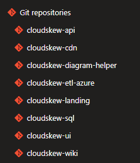

Feature development & bug fixes happen in private/feature branches which are ultimately merged into master branches via pull requests.

[Azure Pipelines](https://docs.microsoft.com/en-us/azure/devops/pipelines/get-started/what-is-azure-pipelines?view=azure-devops) are used for continuous integration: checkins are built, unit tested, packaged and deployed to the test environment. CI pipelines are automatically triggered both on pull request creation as well as checkins to master branches.

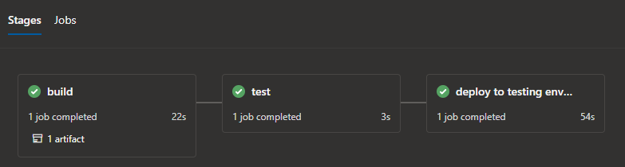

The pipelines are [authored in YAML](https://docs.microsoft.com/en-us/azure/devops/pipelines/yaml-schema?view=azure-devops&tabs=schema%2Cparameter-schema) and executed on [Microsoft-hosted Ubuntu agents](https://docs.microsoft.com/en-us/azure/devops/pipelines/agents/hosted?view=azure-devops).

Azure pipelines' [built-in tasks](https://docs.microsoft.com/en-us/azure/devops/pipelines/tasks/?view=azure-devops) are heavily leveraged for deploying changes to azure app services, functions, storage accounts, container registry etc. Access to azure resource is authorized via [service connections](https://docs.microsoft.com/en-us/azure/devops/pipelines/library/service-endpoints?view=azure-devops&tabs=yaml).

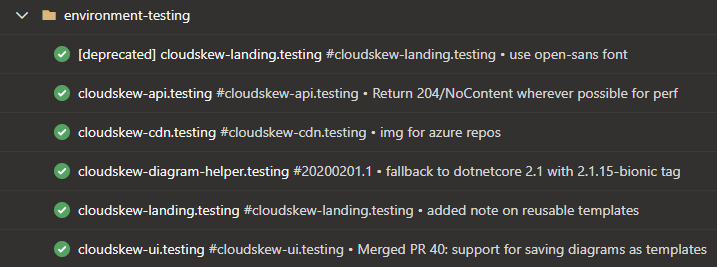

## Deployment & Release

The deployment & release process is very simple at moment (blue-green deployments, canary deployments and feature flags are not being used). Checkins that pass the CI process become eligible for release to production environment.

Azure Pipelines [deployment jobs](https://docs.microsoft.com/en-us/azure/devops/pipelines/process/deployment-jobs?view=azure-devops) are used to target the releases to production environment.

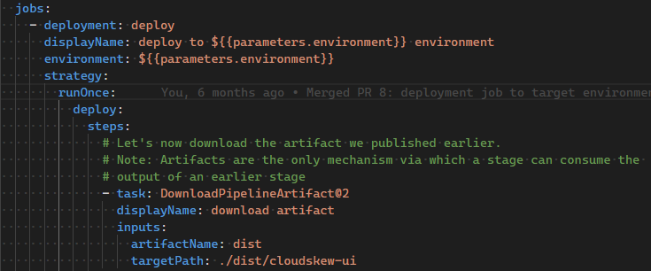

[Manual approvals](https://docs.microsoft.com/en-us/azure/devops/pipelines/process/approvals?view=azure-devops&tabs=check-pass) are used to authorize the releases.

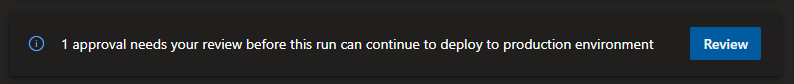

## Future Architectural Changes

As more [features will be added](./../docs/features.md#planned-features) and as usage grows, some architectural enhancements will have to be considered:

* HA with multi-regional deployments and using [Traffic Manager](https://docs.microsoft.com/en-us/azure/traffic-manager/traffic-manager-overview) for routing traffic.
* Move to a higher App Service SKU to avail of slot swapping, horizontal auto-scaling etc.
* Use of caching in the back-end ([Azure Cache for Redis](https://azure.microsoft.com/en-in/services/cache/), ASP.NET's [IMemoryCache](https://docs.microsoft.com/en-us/aspnet/core/performance/caching/memory?view=aspnetcore-3.1))
* Changes to the deployment & release model with blue-green deployments and adoption of feature flags etc.
* PowerBI/Grafana dashboard for tracking business KPIs.

Again, any of these enhancements will ultimately be need-driven.

## Closing Notes

CloudSkew is in very early stages of development and there are some simple thumb rules it abides by:

* **Preferring PaaS/serverless over IaaS**: Pay as you go, no server management overhead _(aside: this is also why K8s clusters are not in the picture yet)_.
* **Preferring microservices over monoliths**: Individual lego blocks can be independently deployed & scaled up/out.
* **Always keeping the infrastructure stable**: Everything infra-related is automated: from provisioning to scaling to monitoring. An "it just works" infra helps maintain the core focus on user-facing features.
* **Releasing Frequently**: The goal is to rapidly go from idea -> development -> deployment -> release. Having ultra-simple CI, deployment & release processes go a long way in helping achieve that.
* **No premature optimization**: All changes for making things more "efficient" is done just-in-time and has to be need-driven _(e.g: Redis cache is currently not required at the back-end since API response times are within acceptable thresholds)_.

When CloudSkew reaches critical mass in the future, this playbook will of course have to be modified.

Please feel free to [email us](mailto:support@cloudskew.com) in case you have any questions, comments or suggestions regarding this article. Happy Diagramming!
